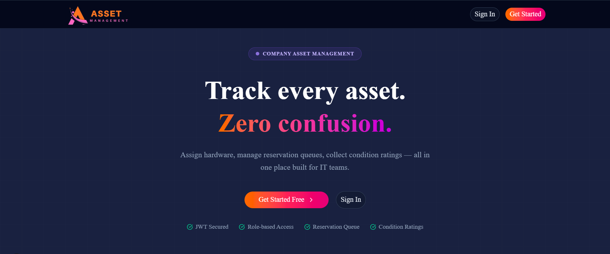
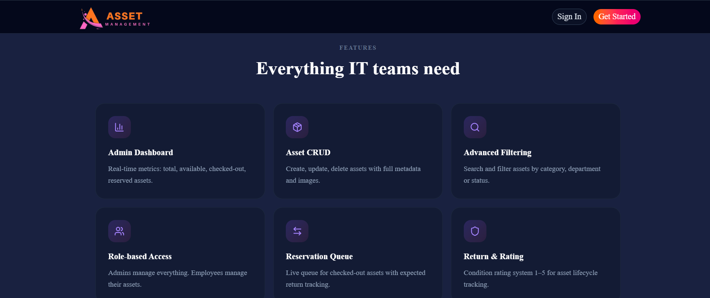
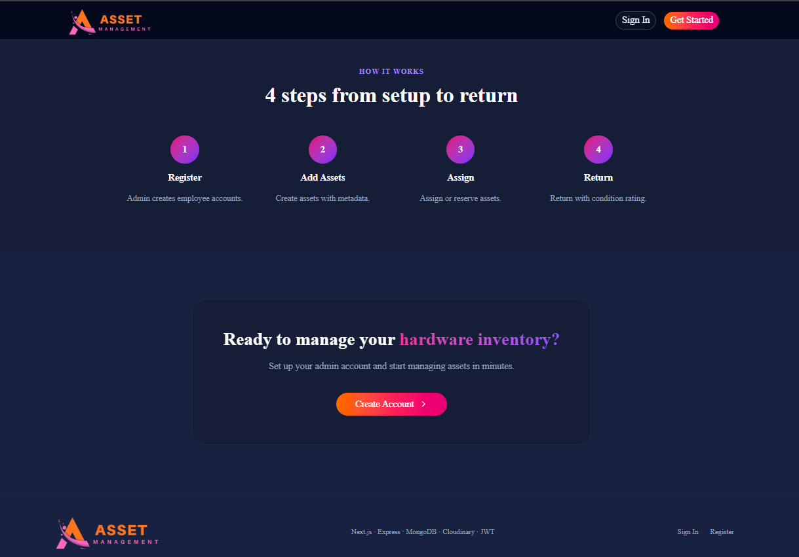
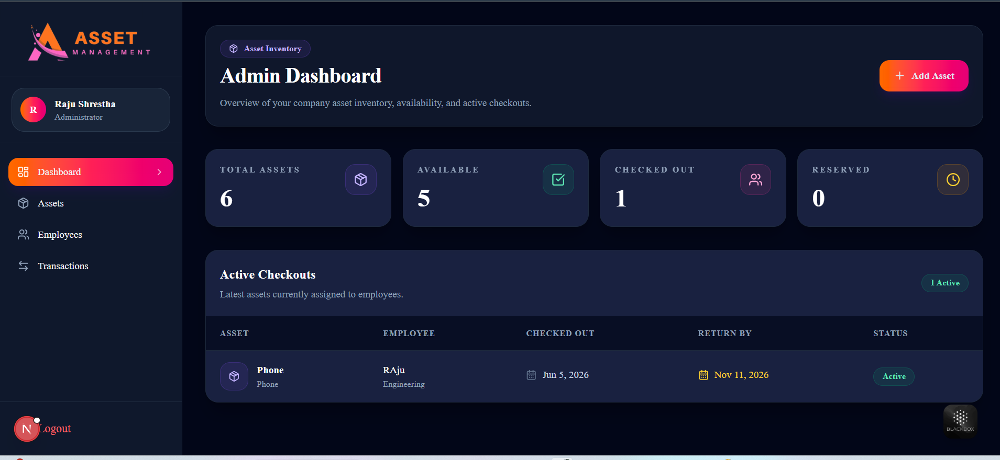
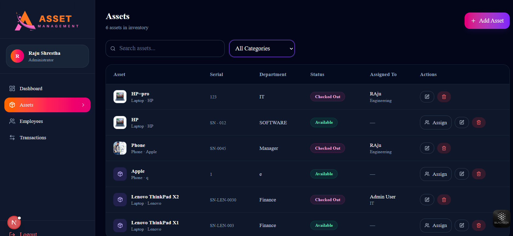
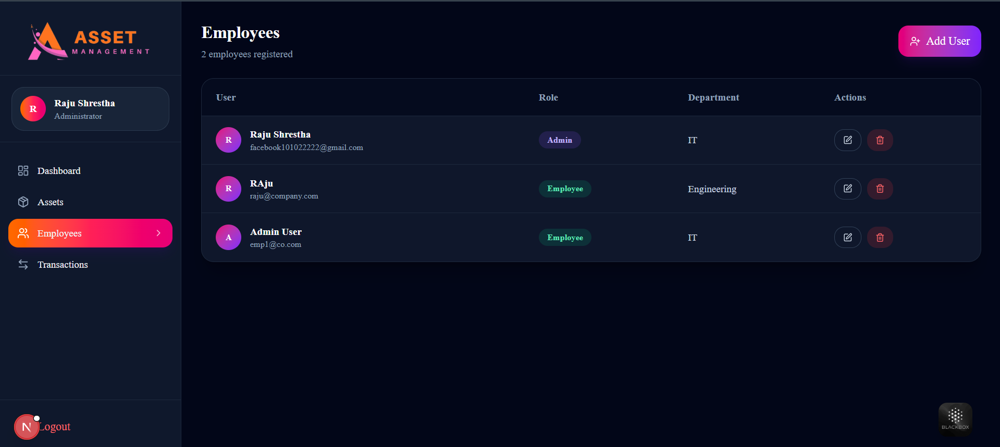
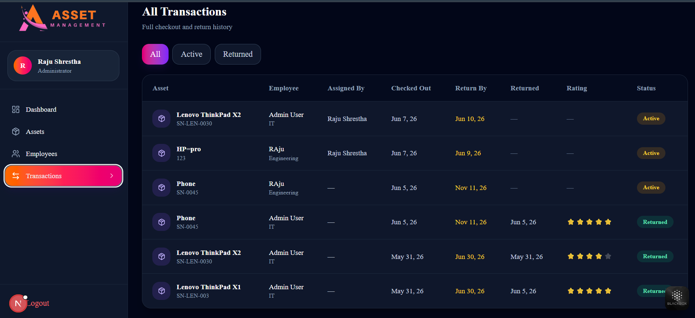
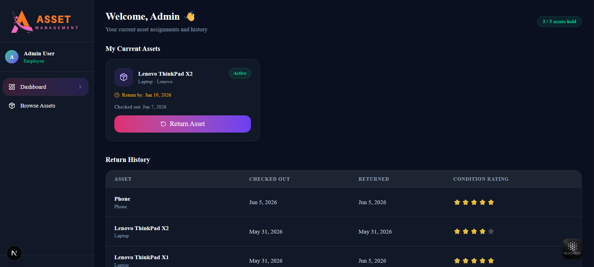
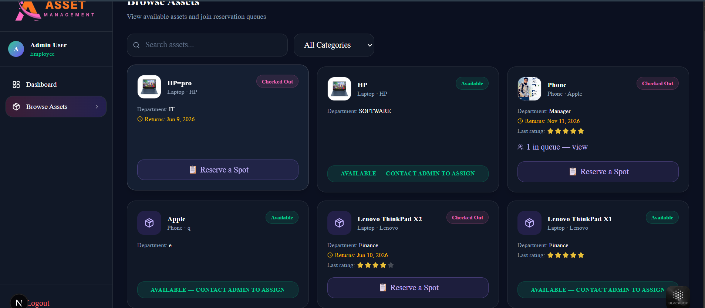

## 1. Introduction
The Asset Management System is a full-stack web application designed to efficiently track, manage, and organize company assets in a centralized platform. It streamlines asset allocation, monitoring, and reporting, helping organizations maintain better control over their resources.

The system is built using a modern web technology stack with Next.js on the frontend and Node.js with Express on the backend, ensuring high performance, scalability, and a smooth user experience. Data is securely stored and managed using MongoDB, while media handling is supported through Cloudinary.

Asset Management provides a role-based portal where:

IT Admins can add assets, assign them to employees with a return date, track condition ratings, and manage all users and transactions from a central dashboard.
Employees can browse the asset catalog, see which devices are available, join a reservation queue for checked-out assets, and return assets with a mandatory condition rating (1–5 stars).

  



### Key Features:
| Feature | Description |
|---|---|
| Role-based access | Admin and Employee roles with separated dashboards and protected routes |
| Asset CRUD | Create, read, update, delete assets with Cloudinary image upload |
| Admin assigns assets | Admin picks employee + sets expected return date; `takenDate` recorded |
| Reservation queue | Employees can queue for a checked-out asset and see the expected return date |
| 3-asset limit | System enforces a maximum of 3 active assets per employee |
| Return with rating | Employees must rate asset condition (1–5) before return is finalised |
| Advanced search & filter | Search by name, filter by category, manufacturer, department, status |
| JWT authentication | Stateless auth with auto-redirect on token expiry |


## Frontend
The frontend of the Asset Management System is built using Next.js (JavaScript) to deliver a fast, responsive, and SEO-friendly user interface. The design focuses on simplicity, usability, and modern UI principles to ensure smooth user experience across all devices.

### Tools & Technologies Used
Next.js (JavaScript) – Framework for building the React-based frontend with routing and server-side rendering support
Tailwind CSS – Utility-first CSS framework for creating a modern and responsive UI
shadcn/ui – Prebuilt accessible UI components for consistent and clean design
Lucide React – Icon library used for modern and lightweight icons
Axios – Used for handling API requests between frontend and backend
date-fns – Utility library for formatting and manipulating dates efficiently


## Backend
The backend of the Asset Management System is built using Node.js and Express.js, providing a robust and scalable RESTful API for managing assets and user operations. It handles authentication, database operations, and business logic, ensuring secure and efficient data flow between the frontend and database.
### Tools & Technologies Used
Node.js – Runtime environment for server-side JavaScript
Express.js – Web framework for building REST APIs
MongoDB – NoSQL database for storing users and asset data
Mongoose – ODM for schema modeling and database interaction
JWT (JSON Web Token) – For secure authentication and authorization
Cloudinary – For image/file uploads and management
bcrypt – For hashing user passwords securely

## API Endpoints

Base URL: http://localhost:3000/api
### Auth USER
http://localhost:3000/api/auth/register
http://localhost:3000/api/auth/login

### Assets
http://localhost:3000/api/assets
http://localhost:3000/api/assets/:id
http://localhost:3000/api/assets/assign/:id
http://localhost:3000/api/assets/return/:id
http://localhost:3000/api/assets/queue/:id


## System Design
The system is designed with a clear separation of concerns between the frontend and backend. The frontend is responsible for user interaction, UI rendering, route-based access, and API communication, while the backend manages business logic, authentication, authorization, validation, and database operations.
JWT-based authentication is used to provide secure and stateless access control across the application. The database schema is structured to manage users, assets, and transactions efficiently, with defined relationships that support asset assignment, return tracking, and transaction history.
The system also includes validation and centralized error handling to maintain data integrity, prevent invalid operations, and provide a smooth user experience.


```txt
┌──────────────────────────────────────────────┐
│                  USERS                       │
│                                              │
│   ┌──────────────┐      ┌──────────────┐    │
│   │    Admin     │      │   Employee   │    │
│   │   Browser    │      │   Browser    │    │
│   └──────┬───────┘      └──────┬───────┘    │
└──────────┼─────────────────────┼────────────┘
           │                     │
           └──────────┬──────────┘
                      │
                      ▼
┌──────────────────────────────────────────────┐
│              FRONTEND LAYER                  │
│                                              │
│            Next.js 14 App Router             │
│                                              │
│   /admin/*              /employee/*          │
└──────────────────────┬───────────────────────┘
                       │
                       │ HTTPS / REST API
                       │ Authorization: Bearer JWT
                       ▼
┌──────────────────────────────────────────────┐
│               BACKEND LAYER                  │
│                                              │
│              Node.js + Express.js            │
│                                              │
│   ┌────────────┐   ┌────────────────────┐   │
│   │    CORS    │   │ JWT Auth Middleware│   │
│   └────────────┘   └────────────────────┘   │
│                                              │
│   ┌────────────┐   ┌────────────┐          │
│   │ /api/auth  │   │ /api/users │          │
│   └────────────┘   └────────────┘          │
│                                              │
│   ┌────────────┐   ┌──────────────────┐    │
│   │/api/assets │   │/api/transactions │    │
│   └────────────┘   └──────────────────┘    │
│                                              │
│            Controllers / Business Logic      │
│                     │                        │
│                     ▼                        │
│              Mongoose Models                 │
└─────────────────────┬────────────────────────┘
                      │
                      ▼
┌──────────────────────────────────────────────┐
│              DATA / SERVICES LAYER           │
│                                              │
│   ┌──────────────┐   ┌──────────────┐       │
│   │ MongoDB Atlas│   │  Cloudinary  │       │
│   │  Database    │   │ Asset Images │       │
│   └──────────────┘   └──────────────┘       │
│                                              │
│   ┌──────────────┐                          │
│   │  .env Config │                          │
│   │ JWT / DB URL │                          │
│   └──────────────┘                          │
└──────────────────────────────────────────────┘
```


## Backend Setup Instructions
- cd backend
- npm install
- cp .env
#### Fill in your credentials in .env
- npm start
##### Server starts on http://localhost:3000

## Frontend Setup Instructions
- cd frontend
- npm install
#### Create .env.local
echo "NEXT_PUBLIC_API_URL=http://localhost:3000/api" > .env.local
npm run dev
##### App starts on http://localhost:3001


## Backend Overview Images





